# FLAG QUIZ

Flag Quiz is a website for everyone that want to challenge themselves and test their vexillology skills!

Visit [Flag Quiz!](https://tossan99.github.io/flag-quiz2/)

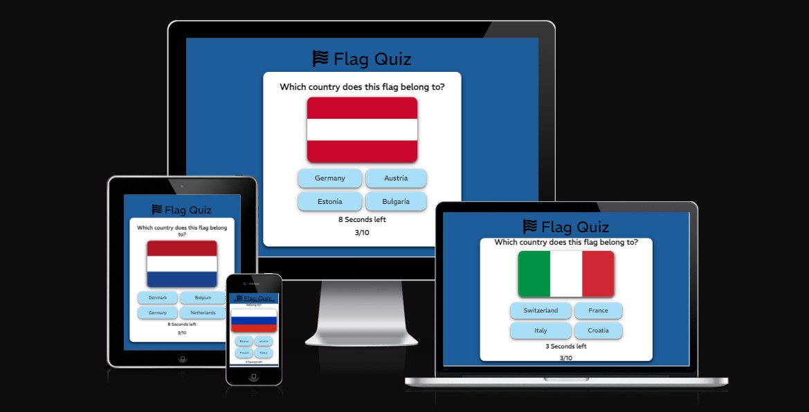

---

## CONTENTS

- [FLAG QUIZ](#flag-quiz)
  - [CONTENTS](#contents)
  - [Design](#design)
    - [Colour Scheme](#colour-scheme)
    - [Typography](#typography)
    - [Wireframes](#wireframes)
  - [Features](#features)
    - [Favicon](#favicon)
    - [Logo](#logo)
    - [Landing Page](#landing-page)
    - [Buttons](#buttons)
    - [Question](#question)
    - [Timer](#timer)
    - [Question Counter](#question-counter)
    - [End Section](#end-section)
    - [Features Left to Implement](#features-left-to-implement)
    - [Accessibility](#accessibility)
  - [Deployment \& Local Development](#deployment--local-development)
    - [Deployment](#deployment)
    - [Local Development](#local-development)
      - [How to Fork](#how-to-fork)
      - [How to Clone](#how-to-clone)
  - [Testing](#testing)
    - [Buttons](#buttons-1)
    - [Responsiveness](#responsiveness)
    - [Validator testing](#validator-testing)
    - [Unfixed Bugs](#unfixed-bugs)
  - [Credits](#credits)
    - [Code Used](#code-used)
    - [Content](#content)
    - [Media](#media)

---

## Design

### Colour Scheme

I wanted to choose one color that goes well with red and green since those colors indicate if you have answered right or wrong in the quiz. The choice was hard but it came down to blue.

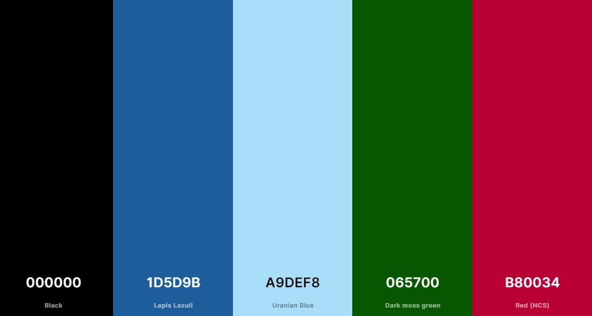

### Typography

Google Fonts was used to import the chosen fonts for use in the site.

I have chosen to use the REM font in bold format since it stands out among all the bright colors and is easy to read.

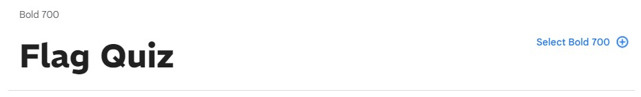

### Wireframes

One Wireframe was created for desktop using [Figma](https://www.figma.com).

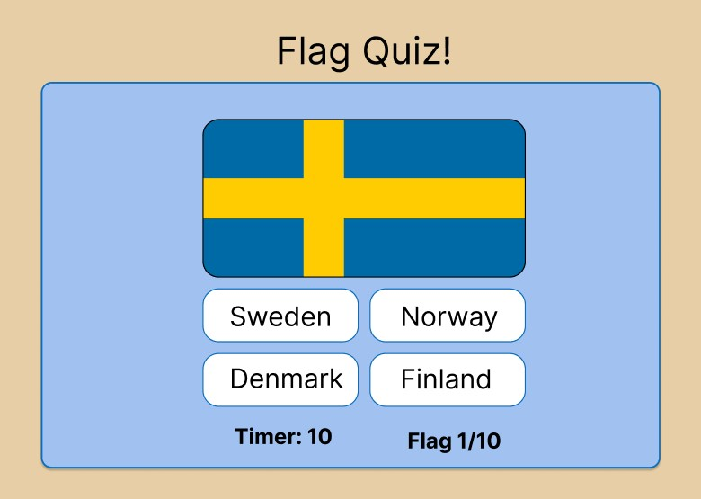

---

## Features

The website consists of only the index page that have 2 sections. The header and the main container that contains all other content.

### Favicon

The page have a simple favicon of a blue flag

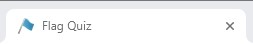

### Logo

The logo is centered in the top of the page above the main container that contains all other content. It's in big bold font so it stands out among the bright colors.

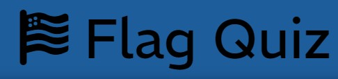

### Landing Page

The landing page is simple and clearly indicates that the user have found it's way to the correct website.

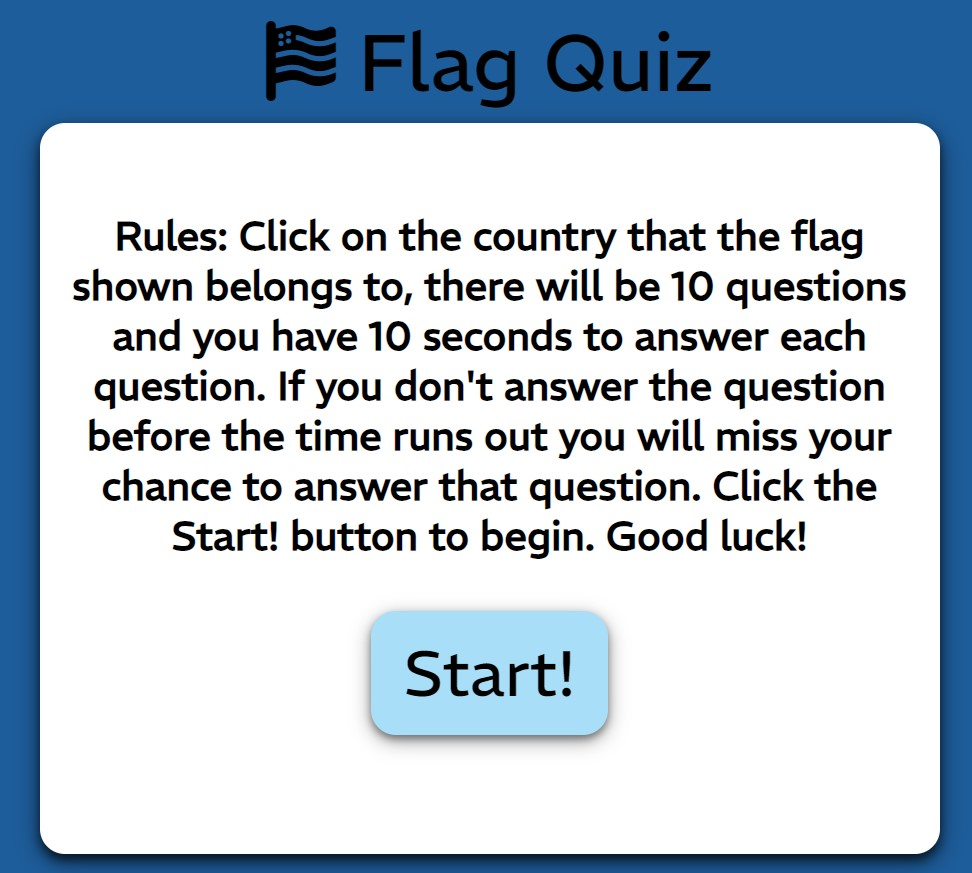

### Buttons

All buttons are styled the same with a light blue color, black text, a slight box shadow and a thin black border when hovering the mouse over it.

- Start Button
    - The start button starts the quiz when clicked.
  
    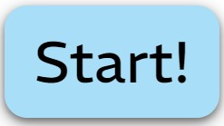

- Answer Buttons
    - The answer buttons display different options to choose from and change colors after one has been clicked. Red for the wrong options and green for the right one.
  
    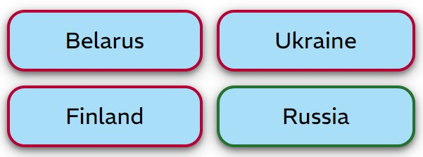

- Next Button
    - When clicked, the next button continue to the next question but only shows up after one of the answer buttons has been clicked.
  
    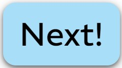

- Check Score Button
    - When clicked, the check score button continue to the final page but only shows up after all questions have been answered.
  
    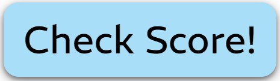
- Restart Button
    - When clicked, the restart button resets the quiz so the quiz can be played again. This button only shows up after the quiz is finished.
  
    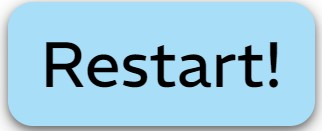

### Question

This section displays a random flag and the question "Which country does this flag belong to?" 

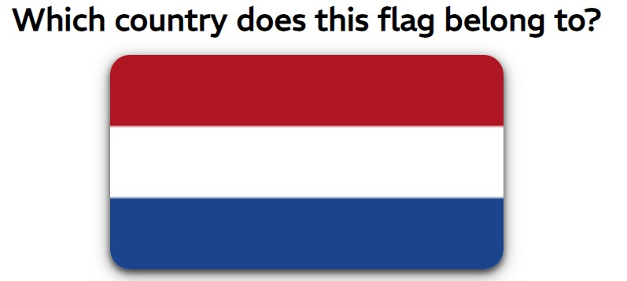

### Timer

The timer counts down from 10 seconds and resets every time the next button is clicked and a new question is displayed. If the user doesn't click any of the answer buttons before the timer goes to 0 the next question will be displayed and the user miss the chance to score a point on the question skipped.

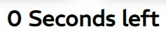

### Question Counter

The question counter displays which question the user is currently on.

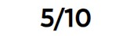

### End Section

The end section is displayed after the user has answered all questions and clicked the "Check Score" button. The section displays how many questions the user answered right on and displays the "Restart!" button that restarts the quiz.

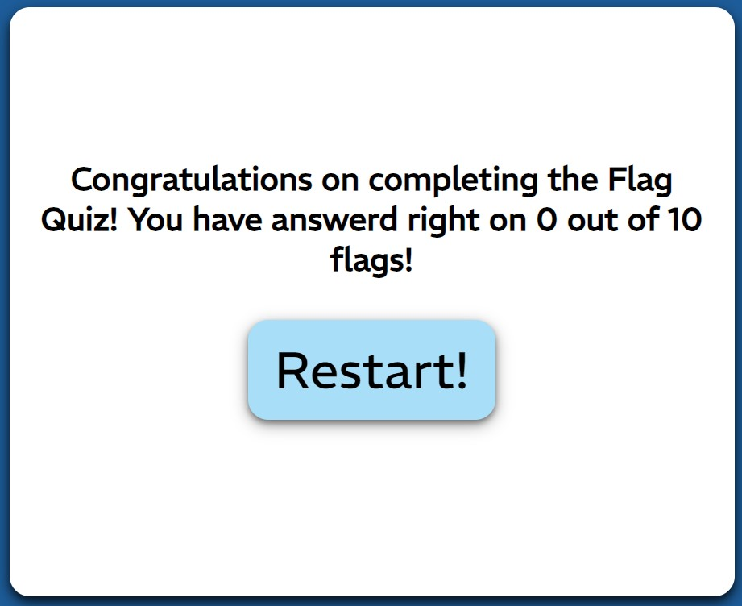

### Features Left to Implement

- Score message 
   - I would like to make the message in the end change depending on how good the user answered on the questions.

- Highscore
    - I would like to add a highscore section to the end page.

- Accessible to visually impaired users
    - I would like to implement alt texts for all flags that describes the flags so visually impaired users could also enjoy this quiz.

### Accessibility

This website is unfortunately not very accessible to visually impaired users since the goal of the quiz is to recognize what the different flags looks like and there is no alt text to describe them since it was to hard to implement.

With that said the website is still designed to have a sufficient color contrast throughout the site.

---

## Deployment & Local Development

### Deployment

The site is deployed using GitHub Pages. Visit the deployed site [here](https://tossan99.github.io/flag-quiz2/). To deploy using GitHub pages:

1. login or Sign Up to GitHub.
2. open the project repository.
3. Click on "Settings" on the navigation bar under the repository title.
4. Click on "Pages" in the left hand navigation panel.
5. Under "Source", choose which branch to deploy. This should be Main for newer repositories (older repositories may still use Master).
6. Choose which folder to deploy from, usually "/root".
7. Click "Save", then wait for it to be deployed. It can take some time for the page to be fully deployed.
8. Your URL will be displayed above "Source".

### Local Development

#### How to Fork

To fork the repository:

1. Log in (or sign up) to Github.
2. Go to the repository for this project, [Flag Quiz](https://github.com/Tossan99/flag-quiz2.git).
3. Click the Fork button in the top right corner.

#### How to Clone

To clone the repository:

1. Log in (or sign up) to GitHub.
2. Go to the repository for this project, [Flag Quiz](https://github.com/Tossan99/flag-quiz2.git).
3. Click on the code button, select whether you would like to clone with HTTPS, SSH or GitHub CLI and copy the link shown.
4. Open the terminal in your code editor and change the current working directory to the location you want to use for the cloned directory.
5. Type 'git clone' into the terminal and then paste the link you copied in step 3. Press enter.

---

## Testing

### Buttons

- All buttons work correctly

### Responsiveness

- All sections of the website has been rigorously tested for responsiveness from 375px width, 650px height and up.
  
- No images are stretched or pixelated.
  
- No element owerlap eachother

### Validator testing

- HTML
  - All html pages have passed through the official [W3C validator](https://validator.w3.org/).
- CSS
  - The CSS code have passed through the official [Jigsaw validator](https://jigsaw.w3.org/css-validator/).
- JS
  - The JS code have passed through [Jshint](https://jshint.com/).

- All sections of the website have been checked with lighthouse and passed with a good score.

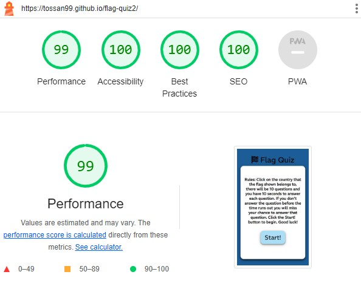

### Unfixed Bugs

There

---

## Credits

### Code Used

During the development of the Java Script behind parts of the website i took inspiration from two different tutorial to make the engaine of the quiz. 

[Tutorial 1](https://www.youtube.com/watch?v=riDzcEQbX6k) and [Tutorial 2](https://www.youtube.com/watch?v=PBcqGxrr9g8&t=1571s).

I also used parts of [this](https://www.youtube.com/watch?v=4piMZDO5IOI) guide to create a timer for the quiz. 

From [this](https://www.w3schools.com/css/css3_shadows.asp) CSS leason i learnt how to create box shadows.

### Content

- The flag icons in the header is implemented from [Font Awsome](https://fontawesome.com/).

- The colors used was found on [Color Hunt](https://colorhunt.co/).

- All fonts are from [Google Fonts](https://fonts.google.com/).

- The Wireframe was created with [Figma](https://www.figma.com/).

- The color palette image was created with [coolors](https://coolors.co/).

### Media

- All images used were taken from [Wikipedia](https://www.wikipedia.com/).

- The favicon was taken from [this source](https://www.iconfinder.com/icons/85367/blue_flag_icon).
