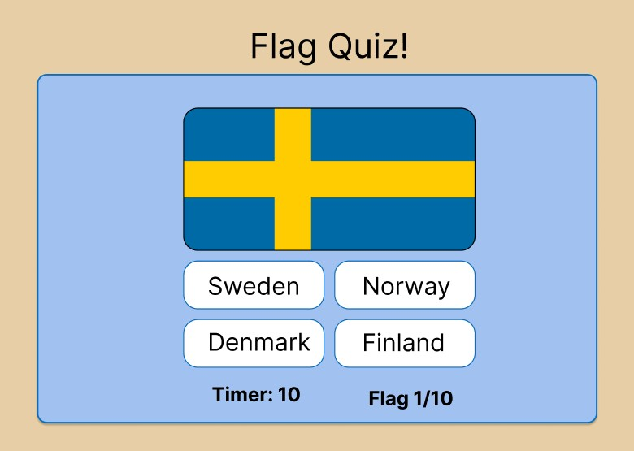

# FLAG QUIZ

Flag Quiz is a website for everyone that want to challenge themselves and test their vexillology skills!

Visit [Flag Quiz](https://tossan99.github.io/flag-quiz2/)

## Features

### Logo

### Header

### Landing page

### Design

### Features Left to Implement

## Testing

### Responsiveness

### Validator testing

- HTML
  - All html pages have passed through the official [W3C validator](https://validator.w3.org/).
- CSS
  - The CSS code have passed through the official [(Jigsaw) validator](https://jigsaw.w3.org/css-validator/).
- JS
  - The JS code have passed through.

### Accessibility

- All pages have been checked with lighthouse and passed with a good score.

### Unfixed Bugs

## Development

### Wireframe

- To begin with I made a Wireframe to get an idea of what the project would look like. It was made through the website [Figma](https://www.figma.com).

## Deployment

- The whole project was deployed to GitHub pages using the Main Branch source.
- All code and files has been submited to Github by using the Git commands "git add", "git commit" and "git push".
- GitHub pages can be reached by opening the settings tab and then open the pages tab.

## Credits

### Content

- The code snippet to create the shadows around the main container was learnt from this [CSS leason](https://www.w3schools.com/css/css3_shadows.asp).

- The flag icons in the header is implemented from [Font Awsome](https://fontawesome.com/).

- The color palette used is from [Color Hunt](https://colorhunt.co/palette/e7cea60a6ebd5a96e3a1c2f1).

- All fonts are from [Google Fonts](https://fonts.google.com/).

### Media

- All images used were taken from [Pexels](https://www.pexels.com/).
